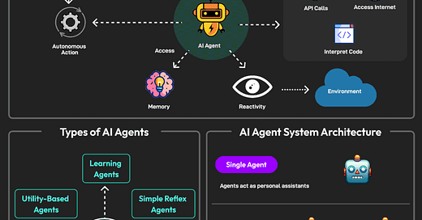

# 👋 Olá! Eu sou o Elias Daniel Viana Alves Alvarenga

---

## 👨‍💻 Sobre mim

Sou estudante de **Ciência da Computação** (Estácio de Sá - 3º Ano) e atualmente atuo como **Jovem Aprendiz Administrativo**. Tenho uma grande sede de conhecimento, buscando evoluir constantemente tanto na área **técnica (TI)** quanto **administrativa (ADM)**.

Apaixonado por tecnologia, já desenvolvi projetos envolvendo **programação, Arduino, automação, elétrica**, e também soluções administrativas, sempre com o objetivo de transformar ideias criativas em soluções práticas e inovadoras.

---

## 🚀 Tecnologias & Ferramentas

  
  
  
  
  
  
  
  
  
  
  
  
  

---

## 🏢 ADM + TI: Unindo Gestão e Tecnologia

- **Administração**: Organização, controle de documentos, atendimento ao público, controle de materiais, suporte nos processos, implantação de rotinas administrativas, experiência em Pacote Office, Google Workspace, organização de reuniões, comunicação e relacionamento.
- **Tecnologia da Informação**: Desenvolvimento em C/C++ e Python, automação com Arduino, lógica de programação, experiência com sistemas operacionais (Windows/Linux), uso de Git e GitHub, montagem e manutenção de computadores, noções de redes, banco de dados (MySQL), automação residencial e elétrica básica.

---

## 🎯 Experiência Profissional

**Jovem Aprendiz Administrativo**  
08/2024 - Atual  
- Organização e controle de documentos para facilitar operações diárias  
- Suporte em processos administrativos, garantindo eficiência organizacional  
- Implementação de rotinas para otimização de processos  
- Atendimento a clientes e parceiros, buscando sempre a melhor experiência  
- Verificação e controle de materiais, evitando perdas  
- Estabelecimento de relações positivas com clientes e fornecedores  
- Apoio na área de TI: configuração de computadores, suporte técnico básico, automação de planilhas e rotinas

---

## 📚 Formação Acadêmica

- **Ciência da Computação** (Cursando)  
  Estácio de Sá — 3º Ano

---

## 🛠️ Habilidades e Competências

- Disposição e vontade de aprender
- Proatividade e disciplina
- Agilidade e pontualidade
- Conhecimento básico em Pacote Office e Google Workspace
- Facilidade com tecnologias digitais
- Criatividade e resolução de problemas
- Colaboração em equipe
- Inteligência emocional sob pressão
- Programação em C/C++ e Python
- Experiência com Arduino, automação e elétrica básica
- Organização e controle de documentos
- Comunicação clara e eficiente
- Automação de tarefas administrativas

---

## 💡 Resumo

Sou apaixonado por Tecnologia da Informação e Administração, buscando unir o melhor dos dois mundos!  
Acredito que o desenvolvimento profissional está diretamente ligado à vontade de crescer e ao esforço contínuo.  
Meu objetivo é ser referência tanto em **ADM** quanto em **TI**, sempre inovando e aprendendo.

---

## 🌍 Idiomas

- Português (Nativo)
- Inglês (Básico - em aprendizado)

---

## 🎖️ Projetos & Destaques

- **Automação residencial com Arduino**  
- **Sistemas de controle de estoque em planilhas inteligentes**  
- **Pequenos bots em Python para automação de tarefas**
- **Montagem e configuração de ambientes Windows e Linux**
- **Participação em eventos e hackathons acadêmicos**

---

## 📫 Contato

- E-mail: elias.daniel01017@gmail.com

---

  

  <strong>“A tecnologia existe para transformar vidas. O meu objetivo é ser um agente dessa transformação!”</strong>

